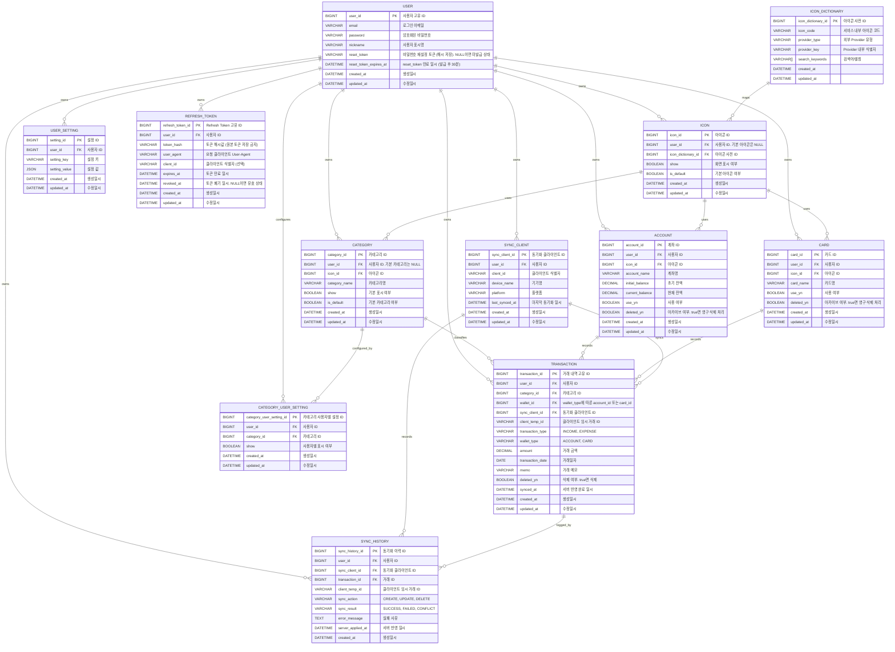

# ERD

## 1. 데이터 관계 개요

미냥이 지갑은 사용자가 직접 입력하는 수입, 지출 거래를 중심으로 계좌, 카드, 카테고리, 아이콘 데이터를 연결하여 관리한다.

본 ERD는 다음 설계 기준을 따른다.

* 사용자별 데이터 분리
* 거래 내역 중심 구조
* 거래는 `wallet_type + wallet_id` 조합으로 계좌 또는 카드를 참조
* `transaction_type`은 수입/지출만 표현하고, 계좌/카드는 `wallet_type`으로 표현
* 사용자 설정은 `USER_SETTING`에서 서버 저장한다
* 오프라인 동기화는 거래만 대상으로 하며 `client_temp_id`, `sync_client_id`, `synced_at` 기준으로 중복과 충돌을 제어한다
* 클라이언트/디바이스 식별과 서버 반영 이력은 `SYNC_CLIENT`, `SYNC_HISTORY`로 관리한다
* 카테고리/아이콘 공통 참조 구조
* 거래 삭제는 `deleted_yn` 기반 Soft Delete 적용
* 계좌/카드는 `use_yn`으로 사용 여부 관리
* 카테고리/아이콘은 `show` 값으로 화면 표시 여부 관리
* 기본 카테고리와 기본 아이콘은 공통 데이터로 저장하고, 기본 카테고리의 사용자별 숨김 상태는 별도 테이블로 관리

---

## 2. ERD



---

## 3. 관계 정의

| 관계                     |  유형 | 설명                                            |
| ---------------------- | --: | --------------------------------------------- |
| USER → TRANSACTION     | 1:N | 한 사용자는 여러 거래 내역을 등록할 수 있다.                    |
| USER → ACCOUNT         | 1:N | 한 사용자는 여러 계좌를 등록할 수 있다.                       |
| USER → CARD            | 1:N | 한 사용자는 여러 카드를 등록할 수 있다.                       |
| USER → CATEGORY        | 1:N | 한 사용자는 여러 사용자 카테고리를 등록할 수 있다. 기본 카테고리는 user_id가 NULL인 공통 데이터이다. |
| USER → CATEGORY_USER_SETTING | 1:N | 한 사용자는 기본 카테고리의 표시 여부를 사용자별로 설정할 수 있다. |
| USER → ICON            | 1:N | 한 사용자는 여러 사용자 아이콘을 등록할 수 있다. 기본 아이콘은 user_id가 NULL인 공통 데이터이다. |
| USER → USER_SETTING    | 1:N | 한 사용자는 여러 설정 값을 저장할 수 있다.                      |
| USER → SYNC_CLIENT     | 1:N | 한 사용자는 여러 동기화 클라이언트 또는 기기를 가질 수 있다.        |
| USER → SYNC_HISTORY    | 1:N | 한 사용자는 여러 동기화 이력을 가진다.                          |
| TRANSACTION → CATEGORY | N:1 | 하나의 거래 내역은 하나의 카테고리에 연결된다.                    |
| CATEGORY → CATEGORY_USER_SETTING | 1:N | 기본 카테고리는 사용자별 표시 설정을 가질 수 있다. |
| TRANSACTION → ACCOUNT  | N:1 | 계좌 거래는 `wallet_type = ACCOUNT`이고 `wallet_id = account_id` 기준으로 계좌를 참조한다. |
| TRANSACTION → CARD     | N:1 | 카드 거래는 `wallet_type = CARD`이고 `wallet_id = card_id` 기준으로 카드를 참조한다.       |
| TRANSACTION → SYNC_CLIENT | N:1 | 오프라인 생성 거래는 서버 반영 시 클라이언트 식별자를 참조한다. |
| SYNC_HISTORY → TRANSACTION | N:1 | 동기화 이력은 서버 반영 대상 거래를 참조한다. |
| SYNC_HISTORY → SYNC_CLIENT | N:1 | 동기화 이력은 요청한 클라이언트 또는 기기를 참조한다. |
| ACCOUNT → ICON         | N:1 | 계좌는 하나의 아이콘을 참조한다.                            |
| CARD → ICON            | N:1 | 카드는 하나의 아이콘을 참조한다.                            |
| CATEGORY → ICON        | N:1 | 카테고리는 하나의 아이콘을 참조한다.                          |
| USER → REFRESH_TOKEN   | 1:N | 한 사용자는 여러 Refresh Token을 가질 수 있다 (다중 기기 지원). |

---

## 4. 주요 ENUM 기준

### 4.1 transaction_type

| 값       | 의미    |
| ------- | ----- |
| INCOME  | 수입    |
| EXPENSE | 지출    |

### 4.2 wallet_type

| 값       | 의미 |
| ------- | -- |
| ACCOUNT | 계좌 |
| CARD    | 카드 |

### 4.3 조합 제약

| transaction_type | wallet_type | 허용 여부 | 설명 |
|---|---|---|---|
| INCOME | ACCOUNT | Y | 계좌 수입 거래 |
| EXPENSE | ACCOUNT | Y | 계좌 지출 거래 |
| EXPENSE | CARD | Y | 카드 지출 거래 |
| INCOME | CARD | N | 카드는 수입 거래를 지원하지 않음 |

---

## 5. 삭제 및 표시 정책

| 테이블         | 컬럼         | 정책                             |
| ----------- | ---------- | ------------------------------ |
| TRANSACTION   | deleted_yn | 거래 삭제 시 `true`로 변경한다.             |
| ACCOUNT       | use_yn     | 계좌 미사용 처리 시 `false`로 변경한다.        |
| ACCOUNT       | deleted_yn | 계좌 아카이브(영구 삭제) 시 `true`로 변경한다. 연결 거래는 `delete_transactions` 옵션에 따라 함께 삭제 처리하거나 보존한다. 아카이브된 계좌의 거래는 조회만 가능하고 수정 불가. |
| CARD          | use_yn     | 카드 미사용 처리 시 `false`로 변경한다.        |
| CARD          | deleted_yn | 카드 아카이브(영구 삭제) 시 `true`로 변경한다. 연결 거래는 `delete_transactions` 옵션에 따라 함께 삭제 처리하거나 보존한다. 아카이브된 카드의 거래는 조회만 가능하고 수정 불가. |
| CATEGORY      | show       | 사용자 카테고리 선택 목록 제외 시 `false`로 변경한다. 기본 카테고리의 기본 표시값이다. |
| CATEGORY_USER_SETTING | show | 기본 카테고리의 사용자별 선택 목록 표시 여부를 관리한다. |
| ICON          | show       | 아이콘 선택 목록 제외 시 `false`로 변경한다.  |
| REFRESH_TOKEN | revoked_at | 폐기 시 `revoked_at`을 현재 일시로 설정한다. 로그아웃, 비밀번호 재설정, 회원탈퇴 시 해당 사용자의 모든 토큰을 폐기한다. |

---

## 6. 통계 산출 기준

| 통계 항목     | 기준 테이블                 | 산출 기준                                            |
| --------- | ---------------------- | ------------------------------------------------ |
| 월간 수입     | TRANSACTION            | `transaction_type = INCOME`인 거래 금액 합산            |
| 월간 지출     | TRANSACTION            | `transaction_type = EXPENSE`인 거래 금액 합산 |
| 최근 내역     | TRANSACTION            | `transaction_date DESC`, `created_at DESC` 기준 정렬 |
| 카테고리별 소비  | TRANSACTION + CATEGORY | `transaction_type = EXPENSE` 기준 소비 금액 합산 |
| 카드별 사용 금액 | TRANSACTION + CARD     | `wallet_type = CARD`이고 `transaction_type = EXPENSE`인 거래 합산 |
| 계좌별 거래 금액 | TRANSACTION + ACCOUNT  | `wallet_type = ACCOUNT` 기준 수입/지출 거래 합산 |
| 계좌 잔액     | ACCOUNT + TRANSACTION  | `wallet_type = ACCOUNT` 거래만 기준으로 초기 잔액 + 수입 - 지출 계산 |

---

## 7. 설정 및 동기화 제약 기준

| 대상 | 제약 |
|---|---|
| USER_SETTING | `(user_id, setting_key)` unique. 주요 setting_key: `theme`, `currency`, `sync_enabled`, `timezone`(기본값 `Asia/Seoul`), `transaction_list_page_size` |
| SYNC_CLIENT | `(user_id, client_id)` unique |
| TRANSACTION | `(user_id, sync_client_id, client_temp_id)` unique. 단 `client_temp_id`가 null인 온라인 거래는 제외 |
| SYNC_HISTORY | `sync_client_id`, `client_temp_id`, `sync_action`, `server_applied_at` 기준 조회 인덱스 |
| ACCOUNT | `(user_id, account_name)` 중복 불가. 단, `deleted_yn=true`인 계좌명은 중복 허용 (아카이브된 계좌명은 재사용 가능) |
| CARD | `(user_id, card_name)` 중복 불가. 단, `deleted_yn=true`인 카드명은 중복 허용 (아카이브된 카드명은 재사용 가능) |
| CATEGORY | 기본 카테고리 `(category_name, is_default)` unique, 사용자 카테고리 `(user_id, category_name)` unique |
| CATEGORY_USER_SETTING | `(user_id, category_id)` unique |
| ICON_DICTIONARY | `icon_code` unique, `(provider_type, provider_key)` unique |
| ICON | 사용자 아이콘 `(user_id, icon_dictionary_id)` unique. 기본 아이콘은 시드 로직에서 중복을 방지 |

동기화 대상은 MVP 기준 거래만 포함한다.

---

## 8. 권장 저장 위치

```text
/docs/05_data-design/ERD.md
```

Mermaid 원본을 별도로 관리하려면 아래 파일을 추가한다.

```text
/docs/05_data-design/erd.mmd
```

`ERD.md`는 설명 포함 문서로 사용하고, `erd.mmd`는 Mermaid 다이어그램 원본 관리용으로 사용한다.
